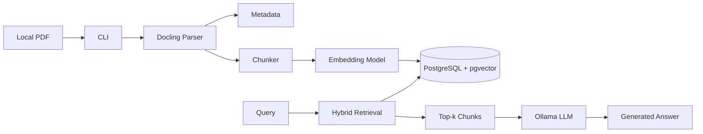
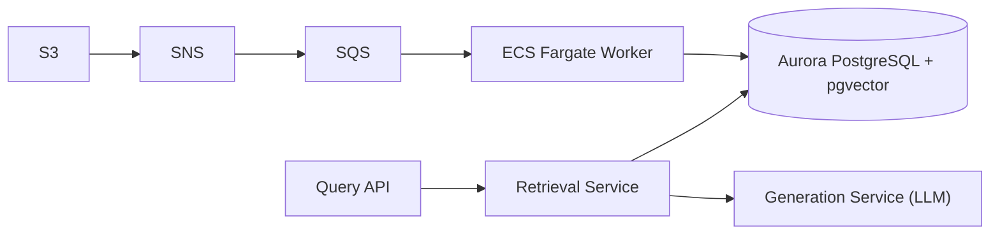
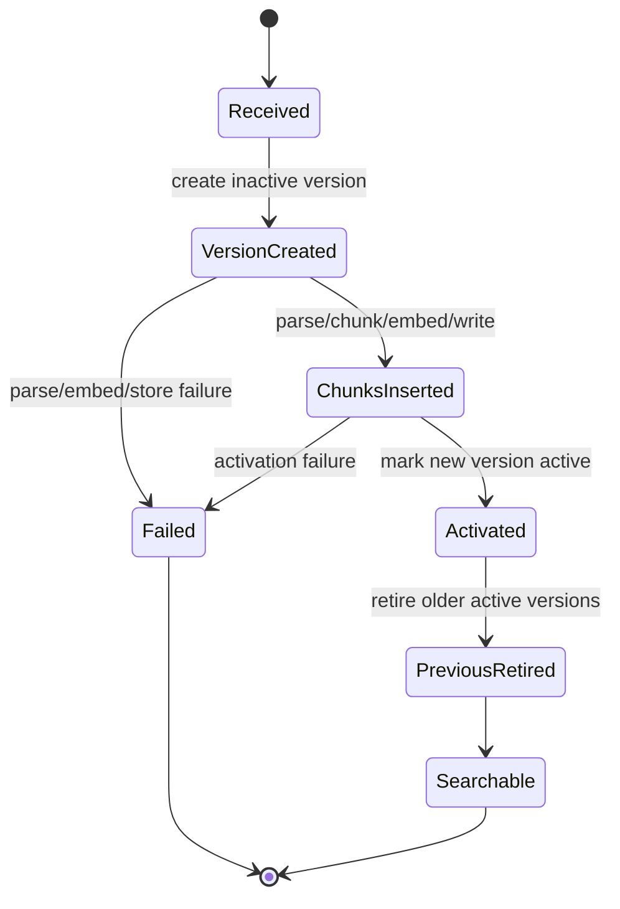

# Architecture

## Local MVP

## Production Direction

The local MVP validates parsing, metadata extraction, chunking, embeddings, versioned ingestion, hybrid retrieval, and local LLM generation via Ollama. AWS integration is intentionally deferred until the local path is stable.

## Runtime Dependency Position

The MVP is CPU-first. Local Windows, macOS, Linux, and Docker development do not require NVIDIA CUDA. Docling, EasyOCR, and sentence-transformers use PyTorch-backed components, so the Docker image installs CPU PyTorch and torchvision first and then installs the remaining dependencies.

## Chunking Baseline

The default chunk target is `350` tokens with `50` tokens of overlap. The embedding model default, `BAAI/bge-base-en-v1.5`, has a 512-token input window, so the baseline leaves room for tokenizer variance while keeping enough overlap for concepts that cross chunk boundaries.

Chunking is recursive and structural. It prefers markdown headers, paragraph breaks, and sentence boundaries before falling back to word windows. Tables are preserved as whole chunks even when they exceed the target because broken table rows usually hurt retrieval quality more than a slightly oversized chunk.

Chunk settings and the boundary order are stored in each chunk's metadata for auditability.

Parent-child retrieval remains a future option: embed smaller child chunks for precision, then expand hits to a larger parent context for generation. That requires a deliberate retrieval/schema change and is not part of the current local MVP baseline.

## Versioned Sync

To prevent retrieval gaps during re-indexing, the system uses a versioned sync approach:

Activation is done in one database transaction after chunks are inserted. Retrieval only joins active document versions.

## Failure Handling

| Failure | Behavior |
| --- | --- |
| Invalid path | CLI exits with a clear validation error. |
| Non-PDF file | CLI rejects input for MVP. |
| Docling missing | Parser reports dependency error; Docker image installs Docling. |
| EasyOCR missing for OCR strategy | Parser reports an EasyOCR dependency error; install `requirements.txt` or use `FAST`. |
| CUDA packages downloaded on CPU-only machines | Treat as dependency misconfiguration; use CPU-first Docker install and avoid forcing the wrong Docker architecture. |
| Parse failure | Ingestion version is marked failed; previous active version remains searchable. |
| OCR failure | Strategy-specific parse error is returned; no partial activation. |
| Embedding failure | Version remains failed; chunks are not activated. |
| Database write failure | Transaction rolls back; previous version remains active. |
| Retrieval failure | CLI returns error with failed retrieval mode. |
| LLM Generation failure | CLI returns error with Ollama connection or generation failure details. |
