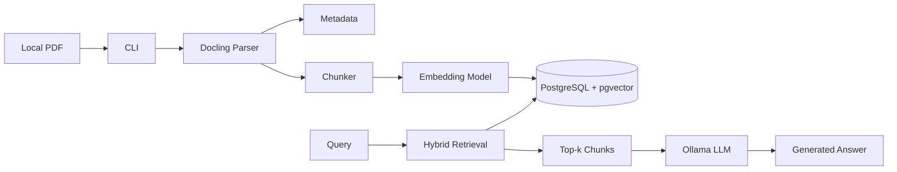
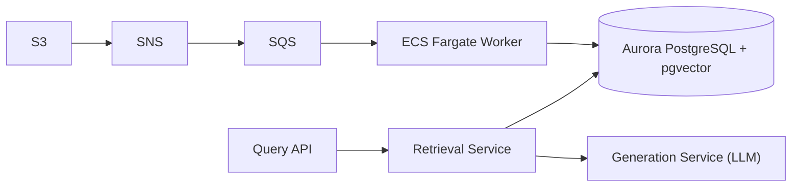
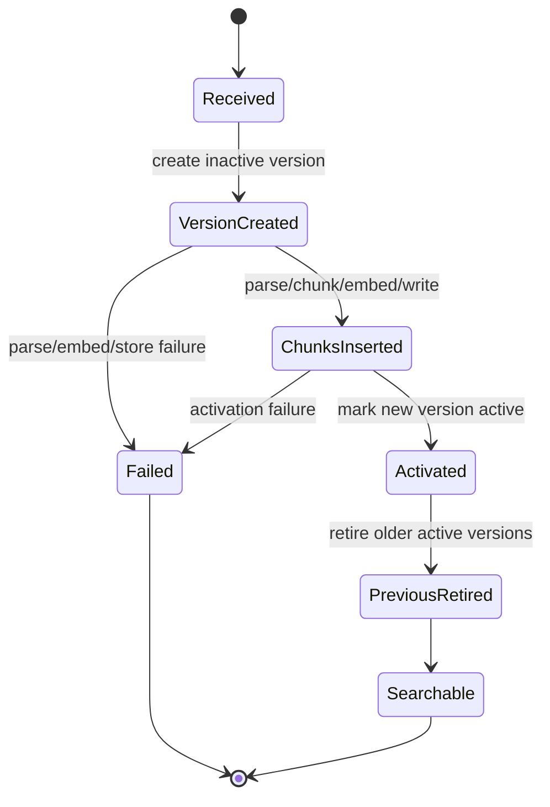

# Architecture

## Local MVP

## Production Direction

The local MVP validates parsing, metadata extraction, chunking, embeddings, versioned ingestion, hybrid retrieval, and local LLM generation via Ollama. AWS integration is intentionally deferred until the local path is stable.

## Runtime Dependency Position

The MVP is CPU-first. Local Windows, macOS, Linux, and Docker development do not require NVIDIA CUDA. Docling and sentence-transformers use PyTorch-backed components, so the Docker image installs CPU PyTorch first and then installs the remaining dependencies.

## Versioned Sync

To prevent retrieval gaps during re-indexing, the system uses a versioned sync approach:

Activation is done in one database transaction after chunks are inserted. Retrieval only joins active document versions.

## Failure Handling

| Failure | Behavior |
| --- | --- |
| Invalid path | CLI exits with a clear validation error. |
| Non-PDF file | CLI rejects input for MVP. |
| Docling missing | Parser reports dependency error; Docker image installs Docling. |
| CUDA packages downloaded on CPU-only machines | Treat as dependency misconfiguration; use CPU-first Docker install and avoid forcing the wrong Docker architecture. |
| Parse failure | Ingestion version is marked failed; previous active version remains searchable. |
| OCR failure | Strategy-specific parse error is returned; no partial activation. |
| Embedding failure | Version remains failed; chunks are not activated. |
| Database write failure | Transaction rolls back; previous version remains active. |
| Retrieval failure | CLI returns error with failed retrieval mode. |
| LLM Generation failure | CLI returns error with Ollama connection or generation failure details. |
